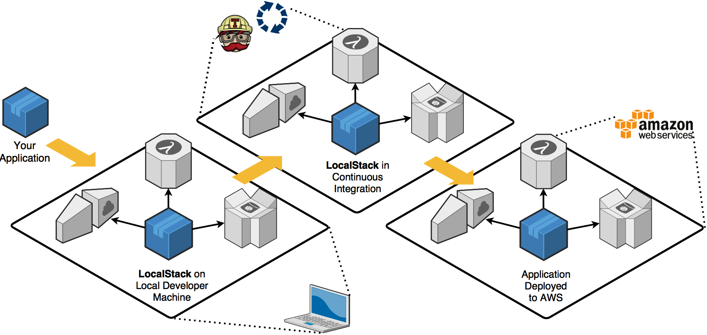

# Boilerplate de Arquitetura Hexagonal

[](https://coveralls.io/github/claytonsilva/nodejs-hexagonal-boilerplate?branch=master)
[](https://dashboard.stryker-mutator.io/reports/github.com/claytonsilva/nodejs-hexagonal-boilerplate/master)
[](http://standardjs.com/)
[](http://conventional-changelog.github.io)
[](https://github.com/conventional-changelog/standard-version)
[](https://dashboard.stryker-mutator.io/reports/github.com/claytonsilva/nodejs-hexagonal-boilerplate/main)


## Inspiração

Inspirado em desenvolver essa arquitetura depois de acompanhar
algumas palestras da Nubank, a ideia
de separação de responsabilidades
por camadas e modelos de testes me fez inspirar a criar um modelo em Node.js.

## O que vem a ser? Aonde vive? Hoje no globo reporter

Antes de tudo vamos no [Wikipedia](<https://en.wikipedia.org/wiki/Hexagonal_architecture_(software)>)
Depois vamos paginar [esse slide bacana da Nubank](https://pt.slideshare.net/Nubank/arquitetura-funcional-em-microservices).

## Já viu os dois? senta que lá vem história


Vamos elencar algumas dores do desenvolvimento:

- Mockar serviços ou testar neles;
- Criar uma condição de teste com volume aceitável de cobertura,
  e possibilidade do seu teste evoluir
  conforme vai a experiência de consumo do produto;
- Projetar Tolerância a falha;
- Saber onde deve entrar o BDD e onde entra o teste unitário; e
- (para galera que curte o lado funcional do Javascript) criar
  codigo 100% puro sem ter que vender o rim.

### Dado isso vamos começar pela camada do meio, aonde ficam os negócios

- É a camada mais pura;
- Não conversa com ninguém, somente é consumido;
- Onde as funções DEVEM ser mais puras possíveis;
- Não precisam de implementar injeção de dependência;
- Não são assíncronas pois recebe tudo que precisa na entrada
  e devolve o objeto necessário; e
- São fáceis de fazer teste unitário porque são puros
  e com entradas que se limita a Arrays e objetos.

Nela deve ficar toda questão de negócios que sua solução propõe,
sabemos que nessa área é onde vai ocorrer
mais mudanças conforme for evoluindo sua aplicação, então
ela tem que ser simpática e amigável a ponto de voce nem ligar
que o jest rode na trigger de pos-commit.

Concentre nela os casos de uso, nela que será construído o seu negócio.

### Adapters

É a cola que une as camadas externas com negócio (é você controller?).

Diferentemente do controller que foi projetado
para arquitetura MVC e todo mundo já deixou alguma
regra de negócio nele que eu sei e não adianta mentir,
ele abstrai totalmente a ideia de ponte e
pode ser aplicado em **qualquer contexto** dando uma
flexibilidade grande para reaproveitamento de código.

---

Importante ressaltar

- camada de negócios conversa com adapter;
- adapter conversa com ports; e
- ~~camada de negócios fala com ports~~.

---

O controller tinha responsabilidade de fazer ponte com a
camada de modelo e ainda sanitizar os dados,
preocupação que veremos na frente em **ports**.

Aqui já ocorre consumo de serviços que precisam ser
simulados (mock, emulador de serviços), então por consequência ocorre
também injeção de dependência, para que a solução permita
entrar com mock com facilidade sem alterar o contexto da função.
O teste unitário começa a ficar mais complicado e
começa os testes de comportamento, pois no adapter
você está claramente consumindo o serviço, mas consumindo de forma direta.

### Ports

As bordas que dão a fama de arquitetura hexagonal, pois foi feito pra abstrair
como um hexágono onde cada lado significa uma porta I/O.

Exemplos de ports:

- máquinas de estado (fila, banco de dados);
- handlers em lambda;
- serviço http com express; e
- log shipper.

Ele pode ser conectado ao ambiente real ou simulado, onde também ocorre injeção de
dependência e o contexto da avaliação de comportamento
foge do contexto das regras de negócio.

Começa a ficar convidativo fazer ainda o BDD, mas com as portas podemos ir além,
através de simulação de serviços como [localstack](https://localstack.cloud/)
podemos chegar a simular alguns volumes de carga
(não generosos por ser simulado e não ter o mesmo throughput de um ambiente real),
e usar [Chaos Monkey](https://en.wikipedia.org/wiki/Chaos_engineering),
isso é possível porque o localstack permite que você simule taxas de erros
nos serviços para testes de resiliência.

Esse [projeto da Netflix](https://github.com/Netflix/chaosmonkey) pode ampliar
seus serviços pra teste como banco de dados por exemplo.

Na integração contínua o localstack é amigável para manter
o mesmo ambiente em várias fases até chegar em produção
passando por várias situações semelhante a serviços reais.



### Como usar esse projeto

É bem simples de já começar rodando

- Configure o `.env` baseado no `.env.example`;
- ligue o localstack com `docker-compose up -d`;
- levante o ambiente demo usando [terraform](https://www.terraform.io/) com os comandos:

```bash
$terraform init
$terraform plan (avalia se é isso mesmo que quer criar)
$terraform apply
```

- Instale as dependências com `yarn install`; e
- Rode o projeto com yarn start.

Irá levantar uma instância de serviço http(Express), e seja feliz no consumo

## Features desse boilerplate

- JsDoc implementado em todos os métodos e separados em namespaces
  na documentação que é gerado toda vez que aplica commit;
- Localstack como ambiente de simulação; e
- Javascript ECMA 2015 com linters que te ajudam a manter o código funcional e puro.
